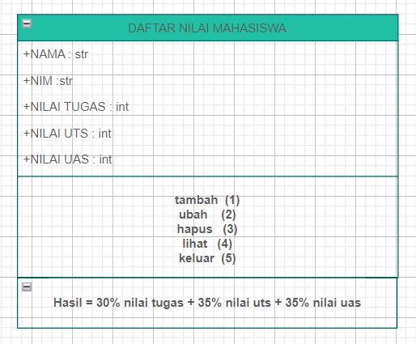
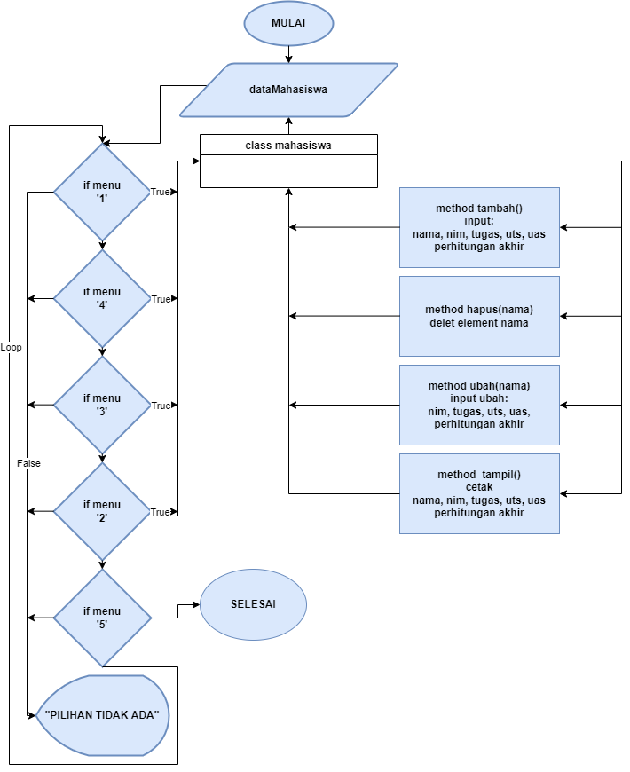
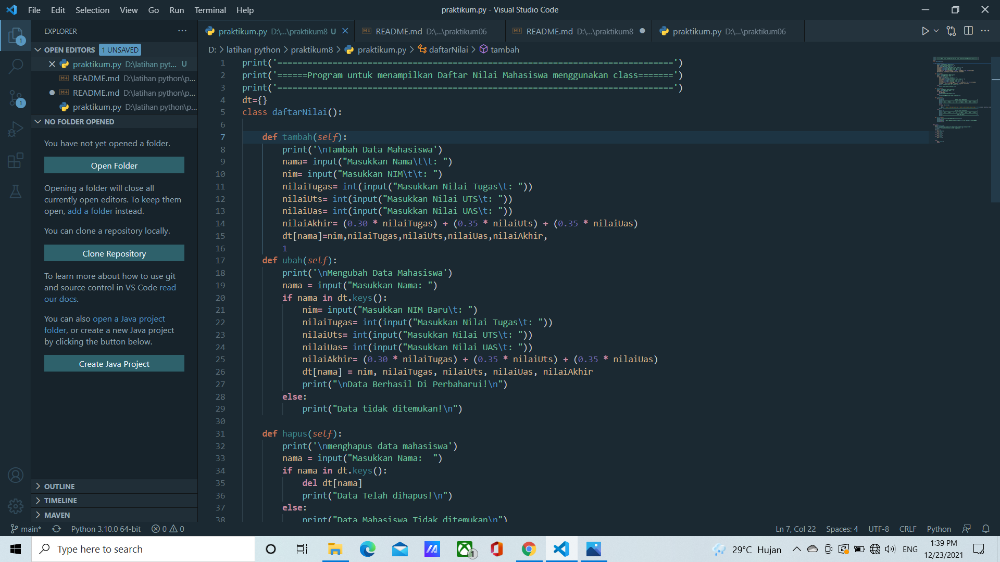
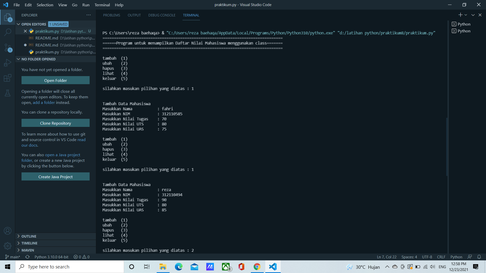
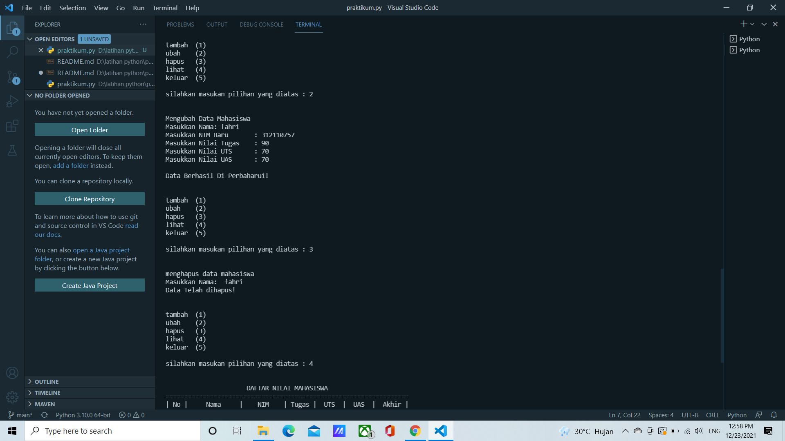
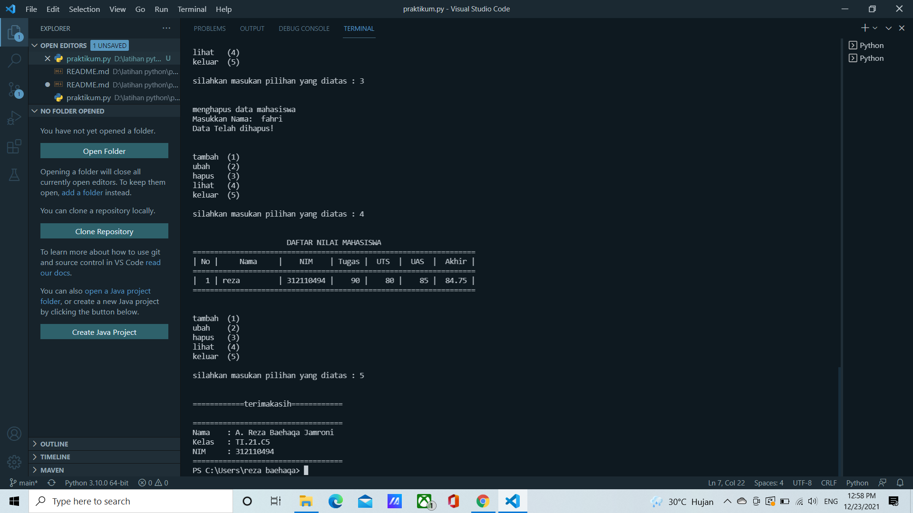

# praktikum8
## Tugas pertemuan ke 12
```sh
Nama    : A. Reza Baehaqa Jamroni
Nim     : 312110494
Matkul  : Bahasa Perograman
```
### PROGRAM INPUT MAHASISWA MENGUNAKAN OOP (CLASS)
Tugas Praktikum<p>

Buat program sederhana dengan mengaplikasikan penggunaan class. Buatlah class untuk menampilkan daftar nilai mahasiswa, dengan ketentuan:<p>
• Method tambah() untuk menambah data<p>
• Method tampilkan() untuk menampilkan data<p>
• Method hapus(nama) untuk menghapus data berdasarkan nama<p>
• Method ubah(nama) untuk mengubah data berdasarkan nama<p>
• Buat diagram class, flowchart dan penjelasan programnya pada README.md.<p>
• Commit dan push repository ke github<p>

### DIAGRAM CLASS
<p>

### FLOWCHART
<p>

### TAMPILAN VISUAL STUDIO CODE
<p>

### HASIL OUTPUT
• Berikut ini adalah contoh hasil dari output programnya yang kit buat dengan pilihan tambah (1), ubah (2), hapus (3), lihat (4), keluar (5) : <p>
<p>
<p>
<p>